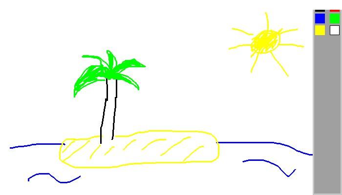

# Raint - 2.0.2

This was (obviously) my very first coding project. Don't worry, I understand the
code in this project is worse than if it had been typed on Word in Comic Sans, but
still I think it's important for me to remember my roots and to see how far I've
come. I also enjoy playing around with this very buggy and not at all extensive
version of Paint. Try it out yourself!

How to use it:
  1. Make sure you have pygame (and python) installed on your machine, if you don't, run
      ```bash
      pip install pygame
      ```
  2. After you install both dependencies, simply run
      ```bash
      ./Raint.py
      ```
  3. Voilà! You can now experience the magnificence of Raint!

Look at this beautiful image I made with Raint (again, cannot stress enough how much
  better of a coder, and an artist I am now-a-days).


